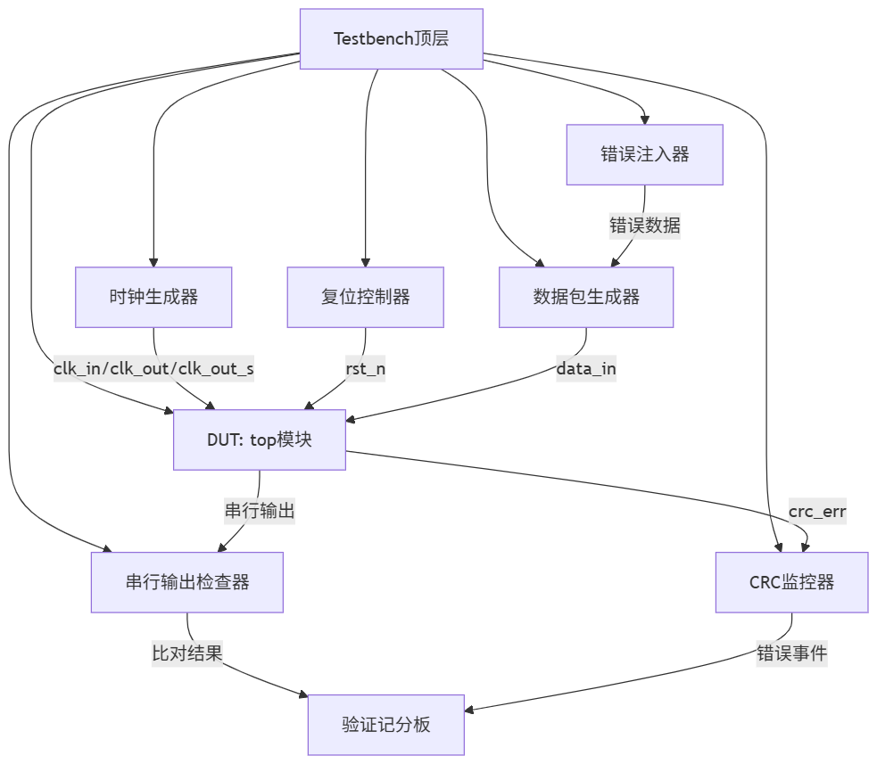

### 验证流程说明书

#### 1. 验证环境架构（基于tb.sv实现）



#### 2. 验证执行流程

##### 阶段1：环境初始化
```systemverilog
// 时钟生成
initial begin
    clk_in = 0;
    forever #(CLK_PERIOD_IN/2) clk_in = ~clk_in;
end
// 其他时钟类似...

// 复位初始化
initial begin
    data_in = 0;
    rst_n = 0;  // 复位激活
    #100;
    rst_n = 1;  // 复位释放
end
```

##### 阶段2：定向测试执行
```systemverilog
    // 基本功能测试
    $display("\n===== 测试1: 基本功能测试 (16、128位数据) =====");
    test_single_frame(8'b0000_0001, 128'hA55A, 16);
    check_output(8'b0000_0001, 128'hA55A, 16);
    
    test_single_frame(8'b0000_0010, 128'h0123...3210, 128);
    check_output(8'b0000_0010, 128'h0123...3210, 128);
```

##### 阶段3：大规模随机测试
```systemverilog
    $display("\n===== 测试4: 大规模随机测试 =====");
    test_rand_frame(single_channel, sent_data, rand_len);
    
    for (int i = 1; i < 5000; i++) begin
        fork
            check_output(single_channel, sent_data, rand_len);
            $display("[%0t ps] 进行第 %0d 次随机测试", $time, i+1);
            test_rand_frame(single_channel, sent_data, rand_len);
        join
    end 
```

##### 阶段4：异常数据测试
```systemverilog
    // 超长数据测试
    send_oversize_frame(8'b0010_0000, {128{2'b10}}, 16'h1145);
    // 状态转移测试
    fsm_test(8'b0000_0001, 128'h0000_0000_0000_0000_0000_0000_0000_A55A, 16, 16'h1934); 
    wait_test(8'b0000_0001, 128'h0000_0000_0000_0000_0000_0000_0000_A55A, 16, 16'h1934); 
```

#### 3. 检查机制实现

##### 自动数据比对
```systemverilog
task check_serial_output;
    // ...
    for (int bit_idx = data_len - 1; bit_idx >= 0; bit_idx--) begin
        if (exp_gray[bit_idx] != data_out) begin
            $error("数据不匹配! 位 %0d: 预期=%h, 实际=%h", 
                bit_idx, exp_gray[bit_idx], data_out);
        end
        #CLK_PERIOD_S;
    end
endtask
```

##### CRC模型验证
```systemverilog
task automatic crc16_ccitt;
    // 实现与DUT一致的CRC算法
    // ...
    crc_value = lfsr_c; // 返回计算值
endtask

// 在测试任务中调用
test_single_frame;
    crc16_ccitt(data, crc_value); // 计算预期CRC
    send_frame(channel, data, data_len, crc_value);
endtask

// 错误监控
always @(posedge clk_in) begin
    if (crc_err) $warning("CRC错误检测");
end
```


#### 4. 报告生成机制

##### 测试结果摘要
```systemverilog
initial begin
    int total_tests, passed_tests;
    // ...
    $display("\n===== 测试总结 =====");
    $display("执行测试: %0d", total_tests);
    $display("通过测试: %0d", passed_tests);
    $display("失败测试: %0d", total_tests - passed_tests);
end
```

#### 5. 仿真自动化设计

##### Makefile命令

说明：执行make sim启动编译并运行仿真，make cov使用dve展示覆盖率，make urg生成urg报告，文件夹名为urg_report
```makefile
……
SIM = vcs
TEST = tb_frame_detector
……
sim: run
	@echo "Simulation started..."
	./simv -l simv.log -cm line+cond+branch+tgl+fsm
	@echo "Simulation finished."

cov: 
	dve -full64 -dir ./covdir.vdb -cov

urg:
	urg -dir ./covdir.vdb -report urg_report
……
```

##### genReport.sh

说明：本脚本依赖python，执行后输出vcsDesignStats和vcsSimprofile
```bash
make check_compile
mv ./vcs_design_stats.log ../doc/10-vcsDesignStats/

echo "no.11, vcs simprofile\n"
# time usage
rm -rf ./profileReport
rm -rf ./simprofile_dir
rm profileReport.*
rm -rf ../doc/11-vcsSimprofile/time
mkdir ../doc/11-vcsSimprofile/time
make simp

./simv  -simprofile time
……
```
