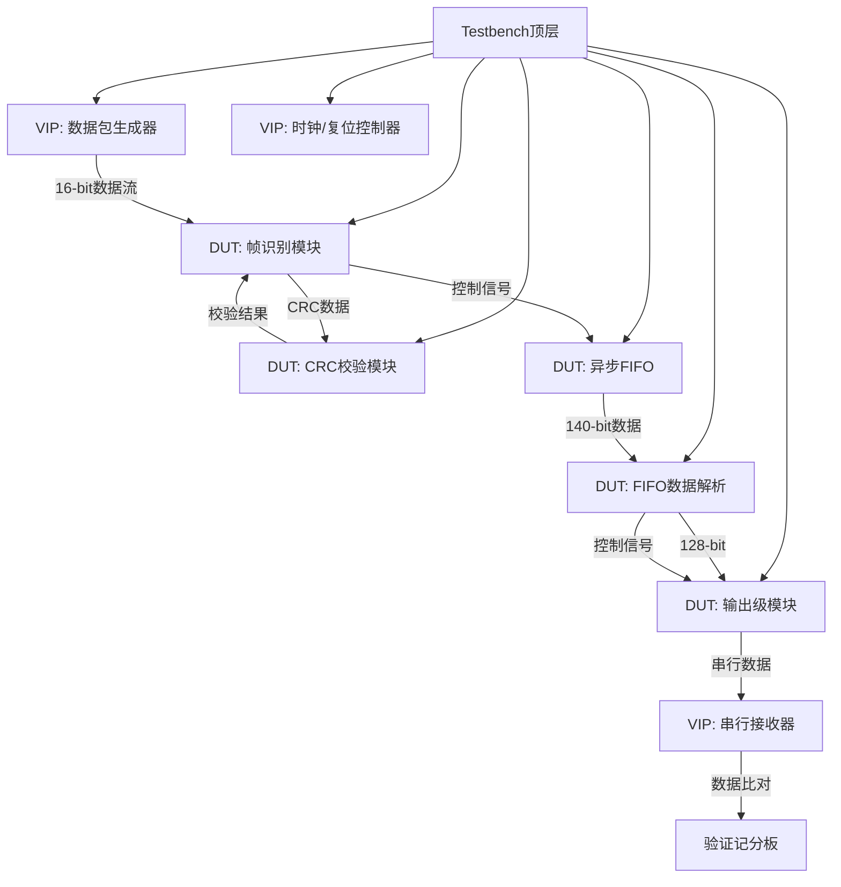
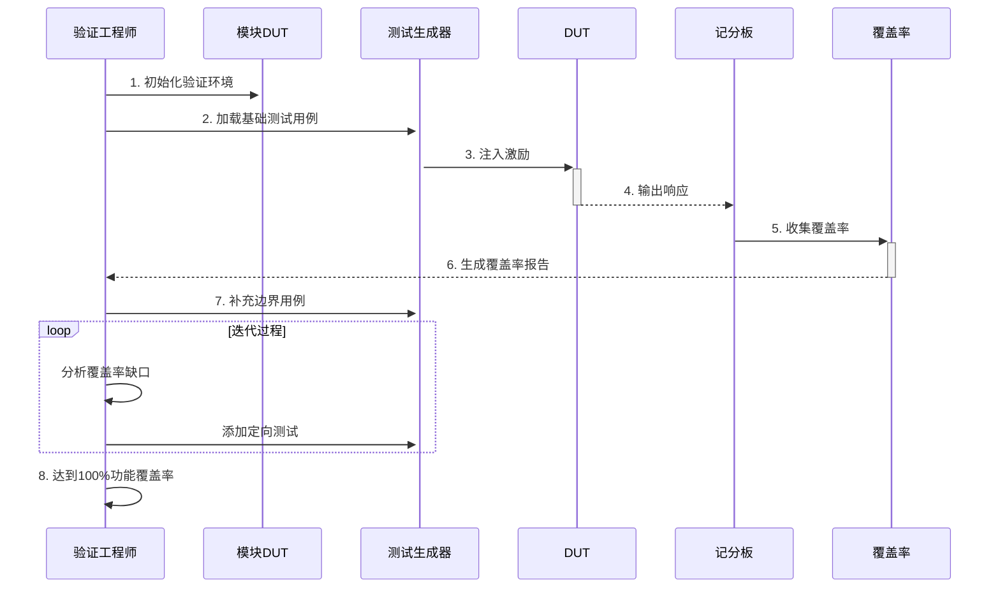

## 数字系统验证流程说明书

### 1. 验证环境架构


### 2. 验证流程

#### 阶段1：单元模块验证


#### 阶段2：集成验证
| 步骤 | 活动 | 交付物 |
|------|------|--------|
| 1 | 模块间接口连接检查 | 接口协议检查报告 |
| 2 | 时钟域交叉测试 | CDC违例报告 |
| 3 | 数据通路完整性验证 | 端到端数据比对日志 |
| 4 | 背压机制测试 | FIFO满/空状态监控 |
| 5 | 错误注入测试 | 错误恢复分析报告 |

#### 阶段3：系统级验证
1. **真实流量模拟**
   - 持续24小时压力测试
   - 随机化包长(16-128位)和通道选择
   - 注入10%错误数据包

2. **性能测试**
   ```python
   # 伪代码：吞吐量测试
   for clock_freq in [50, 75, 100]:
       set_clock(clock_freq)
       measure_throughput()
       check_latency(MAX_LATENCY)
   ```

3. **功耗分析**
   - 典型场景：0.5×数据速率
   - 峰值场景：100% FIFO利用率
   - 空闲场景：仅时钟运行

### 3. 关键检查点

#### 时钟域交叉检查表
| 信号 | 源模块 | 目标模块 | 同步策略 | 最大延迟 |
|------|--------|----------|----------|----------|
| fifo_w_enable | input_stage | async_fifo | 双触发器 | 2周期 |
| fifo_full | async_fifo | input_stage | 格雷码 | 3周期 |
| data_gray | fifo_resolu | output_stage | 寄存器采样 | 1周期 |

#### 覆盖率目标
| 覆盖率类型 | 目标值 | 测量点 |
|------------|--------|--------|
| 代码覆盖率 | 100% | 语句/分支/条件 |
| 功能覆盖率 | 100% | 状态机/边界条件 |
| 断言覆盖率 | 100% | 接口协议 |
| 翻转覆盖率 | 95%+ | 关键寄存器 |

### 4. 回归测试策略

**自动化测试框架**
```yaml
test_suites:
  - name: 基础功能
    tests: [复位测试, 空满标志, 单包传输]
    weight: 20%
    
  - name: 边界条件
    tests: [最小包长, 最大包长, FIFO深度测试]
    weight: 30%
    
  - name: 错误场景
    tests: [CRC错误, 帧头错误, 通道冲突]
    weight: 25%
    
  - name: 性能测试
    tests: [吞吐量, 时钟切换, 背压测试]
    weight: 25%
```

**回归测试触发条件**
1. RTL代码变更（Git commit触发）
2. 每日夜间自动执行
3. 发布前的最终验证

### 5. 验证交付物

**交付物清单**
1. 验证计划（已完成）
2. 测试用例规格文档
3. 覆盖率报告（HTML格式）
4. 时序收敛报告
5. 功耗分析报告
6. 缺陷跟踪报告
7. 签核检查表

**签核标准**
1. 所有严重缺陷解决率100%
2. 功能覆盖率100%达标
3. 时序满足100MHz要求
4. 通过72小时持续测试
5. 错误注入测试恢复率>99.9%

> **验证周期**：预计4周  
> **资源需求**：2名验证工程师 + 1000小时仿真算力  
> **风险控制**：每周评审覆盖率进展，预留20%缓冲时间应对复杂缺陷调试